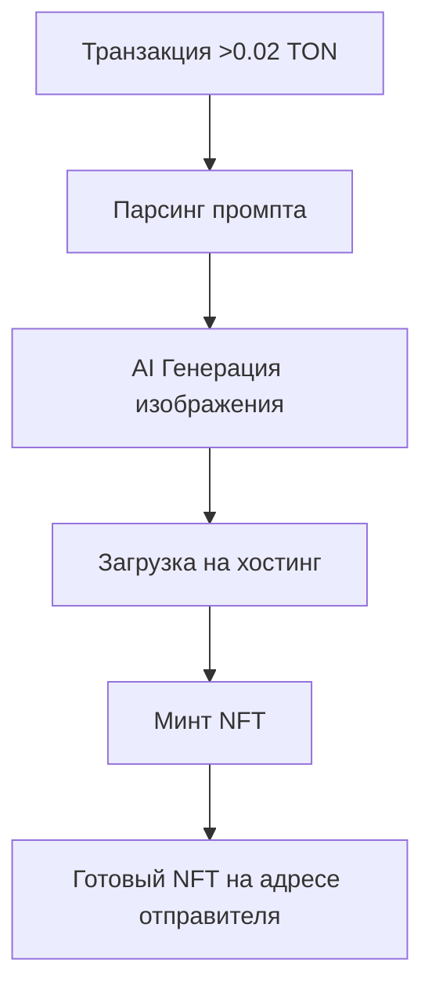

# ton-nft-ai
Скрипт imageai.py автоматически создает NFT с AI-генерацией изображений на основе транзакций в сети TON. GetGems api.


🎮 Как использовать

1. Запустите скрипт

```bash
python imageai.py
```

Вы увидите:

```
🚀 AI NFT Generator запущен!
👛 Адрес кошелька: EQCP3m3nG7T6atRKXx53pDPhsbks--KvVNlrHqayKhMjKeCY (настраивайте сами)
💡 Отправьте >0.02 TON с комментарием-промптом
🤖 AI сгенерирует изображение и создаст NFT
============================================================
```

2. Отправьте транзакцию

· Сеть: TON Testnet
· Адрес: EQCP3m3nG7T6atRKXx53pDPhsbks--KvVNlrHqayKhMjKeCY
· Минимальная сумма: 0.02 TON (для минта NFT)
· Комментарий: Ваш промпт для AI-генерации

3. Наблюдайте процесс

Скрипт автоматически:

Обнаружит транзакцию
Сгенерирует изображение через AI
Загрузит изображение (через хостинг файлов)
Создаст NFT


🔧 Технический процесс

Последовательность работы:



Детали этапов:

1. Мониторинг транзакций

· Проверяет новые транзакции каждые 5 секунд
· Игнорирует суммы менее 0.02 TON
· Использует TON Center API
GetGems api
2. AI Генерация

· API: NeuroImg.art
· Модель: AniFlux-v4.1
· Размер: 1024x1024 пикселей
· Шаги: 25
· Формат: PNG

3. Загрузка изображений

·  Я Использую upload.py для загрузки
· Сохраняю на хостинг файлов
· Возвращает постоянную ссылку на фото от нейросети, так как нейросеть возвращает невалидную ссвлку для ммнта NFT

4. Создание NFT

· Платформа: GetGems testnet/mainnet
· Коллекция: Указанная в конфигурации
· Атрибуты: Промпт, тип генератора
· Владелец: Отправитель транзакции


📊 Логи работы

Успешный процесс:

```
📥 Найдено новых транзакций: 1
🎯 Обрабатываем транзакцию: 0.03 TON, промпт: 'космический корабль'
🎨 Генерируем изображение для промпта: 'космический корабль'
🕒 В очереди: 2/8
🎨 Генерация изображения...
✅ Изображение готово!
📥 Скачиваем изображение: https://ai-api.test/i/12345678.png
✅ Изображение загружено: http://mysite.com/loads/abc123.png
📦 Минтим NFT...
✅ NFT успешно создан!
🔗 Ссылка: https://testnet.getgems.io/collection/.../NFT_ADDRESS
```

Ошибки:

```
❌ Сумма меньше 0.02 TON, пропускаем
❌ Ошибка генерации: Network error
❌ Ошибка загрузки: Invalid file type
❌ HTTP ошибка: 400
```


🛠️ Требования

Файлы проекта:

```
project/
├── imageai.py          # Основной скрипт
├── upload.py           # Загрузчик изображений
├── getgemsapi.py       # API для минта NFT
└── transaction.py      # Мониторинг транзакций
```

🎉 Примеры результатов

После успешного выполнения вы получите NFT с:

· Уникальным AI-изображением по вашему промпту
· Метаданными с атрибутами генерации
· Ссылкой на GetGems для просмотра
· Владением на вашем кошельке

Мой telegram: @pamblus
